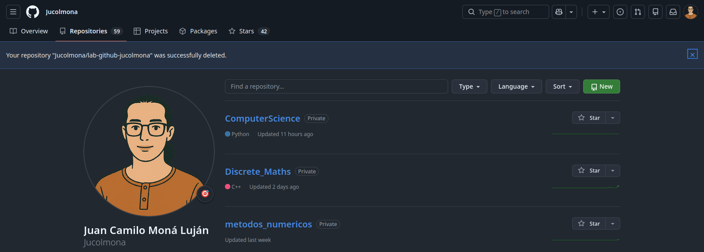
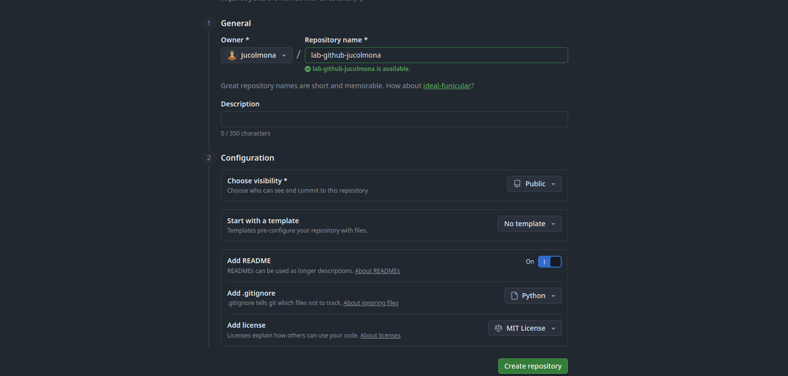

# lab-github-jucolmona

Primera practica o laboratorio de la materia de Estructura física de la información del pregrado de Ingeniería de Sistemas virtual de la Universidad de Antioquia. 
## Objetivos
- Familiarizarse con los comandos y el flujo básico de git y la plataforma de repositorios GitHub.
- Entender como es el flujo de trabajo en los equipos de desarollo de software

## Desarrollo

---

---
